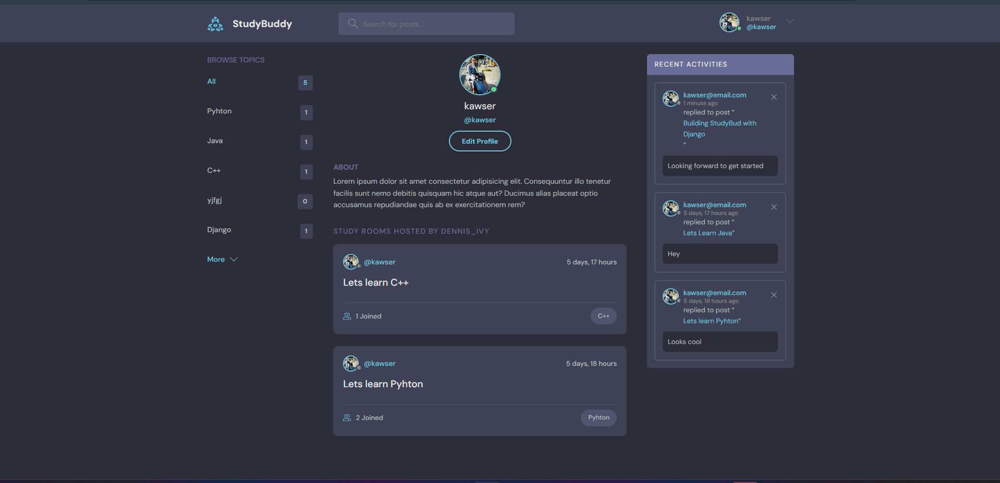

# StudyBud

A **Study Room Application** built using Django, enabling users to create, join, and participate in topic-specific discussion rooms. This project is designed to showcase backend development skills while emphasizing clean architecture, user management, and responsive design.

## Features

1. **User Authentication**: Users can register, log in, and update profiles, including uploading profile pictures.
2. **Topic-Based Discussion**: Users can create, join, and manage rooms categorized by topics.
3. **Search and Filter**: Search rooms by topic or keywords.
4. **Responsive Design**: Optimized for mobile and desktop views.
5. **Activity Tracking**: Displays recent activities and room statistics.

## Screenshots




## Installation

1. **Clone the repository**:
   ```bash
   git clone https://github.com/kabhuiyan/studybud.git
   cd studybud

2. **Install dependencies**:

    ```bash
    pip install -r requirements.txt
    ```

3. **Run migrations**:

    ```bash
    python manage.py migrate
    ```

4. **Start the development server**:

    ```bash
    python manage.py runserver
    ```
## Usage

1. **Create an account** or **log in** using the authentication system.
2. **Explore topics** in the study room list.
3. **Participate in discussions** by joining a room or creating a new one.
4. **Update your profile** to personalize your experience, including uploading a profile picture.
5. **Search rooms** or filter by topics to find relevant discussions.

## Tech Stack

- **Backend**: Django
- **Frontend**: HTML, CSS, JavaScript
- **Database**: SQLite (default)
- **Hosting**: Localhost (development)

## Future Improvements

1. Adding **unit and integration tests** to ensure code reliability.
2. Enhancing **analytics** for tracking room engagement and user activity.
3. Introducing features like **private messaging**, **group invites**, and **email notifications**.
4. Improving performance and scalability for production readiness.

